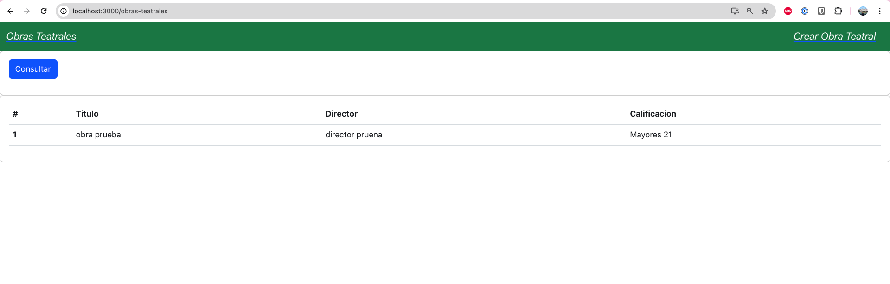
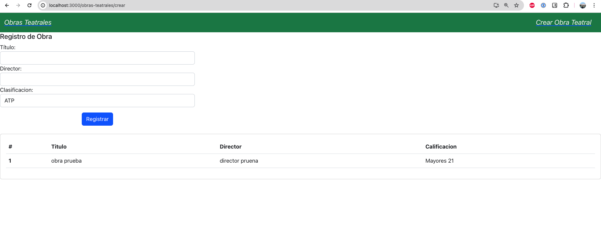

# Consideraciones sobre el simulacro:
Midan sus tiempos ⌛ ⏳

## Antes de arranca
Copien el contenido en sus portafolios. Recuerden no copiar la carpeta oculta `.git`

## Simulacro
1. Crear frontend
3. Crear NavBar o Menu con Cosultar y registrar.
4. Consultar Obras. Por ejemplo
 
5. Crear una Obra, tambien debe tener la tabla de consulta. Por ejemplo
 
4. Editar Obra (si se animan, animense!)

## Opcional
2. Si quieren usar bootstrap puede agregar en las depencias: `"react-bootstrap": ...`

## Solucion propuesta:
La van a encontrar en este mismo repo, en la rama `guia`. Acá usé rreact-bootstrap

## Documentacion guía:
- Bootstrap-react: https://react-bootstrap.netlify.app/docs/components/accordion
- React: https://react.dev/reference/react/useEffect
- React router: https://reactrouter.com/en/main/hooks/use-navigate

> Google, stackoverflow y chat GPT (lean y busquen comprender, cualquier cosa pregunten)